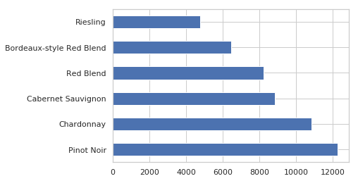
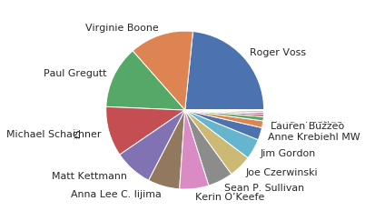
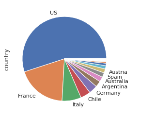
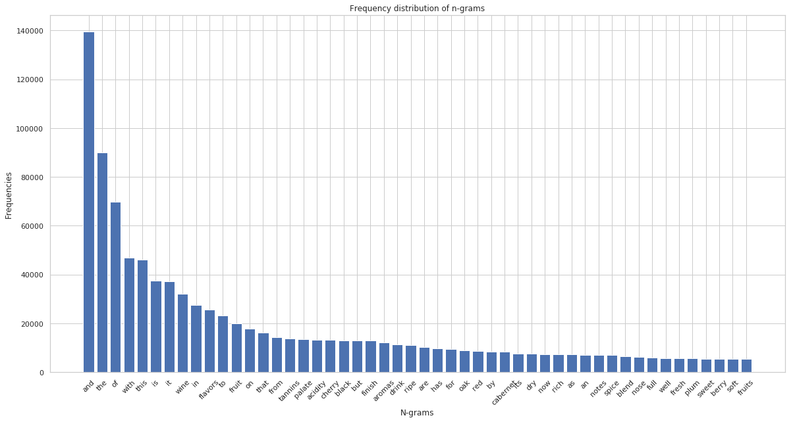
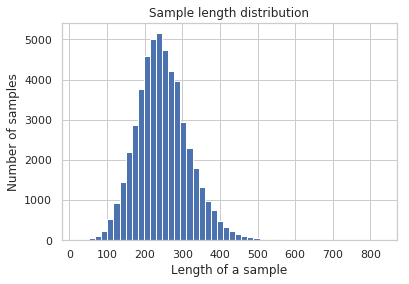

# Blind Ｗine tasting

- **Data set:**[Wine Reviews](https://www.kaggle.com/zynicide/wine-reviews)

  

# Conclusion

​    根據品酒師評論葡萄酒的描述，用來分類是屬於哪一種葡萄所釀造的酒，使用一些Machine learning的方法，最終可得到**Testing Error約在0.135**。

Cross Validation  for  My Model

|       | Training Error | Testing Error |
| :---: | :------------: | :-----------: |
| Count |      100       |      100      |
| mean  |    0.000294    |   0.133912    |
|  std  |    0.000076    |   0.002571    |
|  min  |    0.000167    |   0.127453    |
|  25%  |    0.000243    |   0.132067    |
|  50%  |    0.000278    |   0.133832    |
|  75%  |    0.000333    |   0.135435    |
|  max  |    0.000555    |   0.140988    |

----

# 1. Introduction
[Somm](https://www.imdb.com/title/tt2204371/)是一部描述四個品酒師考取Master Sommelier的電影，在當中有項測試是盲品，再不看酒標的狀態下，憑藉著酒的氣味、顏色、香味去判斷葡萄酒的品種、產區、品牌、年份，甚至哪片葡萄園。

在此，我們想要根據品酒師喝下葡萄酒後的評論來猜測這瓶酒的葡萄品種，讓我們的機器也能擁有盲品的能力。

# 2. Data 

## 2.1 Description

- #### Flie Content

  | Data                 | Size     | n(observations) | p(variables) |
  | -------------------- | -------- | --------------- | ------------ |
  | winemag-data-130k-v2 | 50.46 MB | 119988          | 13           |

- #### Part of the data (winemag-data-130k-v2)

  因資料過於龐大，無法將所有變數列出，若需要詳細資料可至[Wine Reviews](https://www.kaggle.com/zynicide/wine-reviews)查看。

  | Country | Description                                       | Designation                        | Variety            |
  | ------- | ------------------------------------------------- | ---------------------------------- | ------------------ |
  | US      | Pineapple rind, lemon pith and orange blossom ... | Reserve Late Harvest               | Riesling           |
  | US      | Much like the regular bottling from 2012, this... | Vintner's Reserve Wild Child Block | Pinot Noir         |
  | US      | Soft, supple plum envelopes an oaky structure ... | Mountain Cuvée                     | Cabernet Sauvignon |

## 2.2 Variables

* #### Response variables(imbalance)

  在此資料集中葡萄種類一共有707種，但有些葡萄種類樣本過少，所以選擇預測前六大的葡萄種類。

  |Response variables(Variety)|n(observations)|
  |:------:|:-:|
  |Pinot Noir|12276|
  |Chardonnay|10865|
  |Cabernet Sauvignon|8833|
  |Red Blend|8237|
  |Bordeaux-style Red Blend|6467|
  |Riesling|4773|
  |**Total**|**51451**|

* #### Predictor variables

  對於喝下葡萄酒之後品酒師的描述。

  | Description                                                  |
  | ------------------------------------------------------------ |
  | Pineapple rind, lemon pith and orange blossom start off the aromas. The palate is a bit more opulent, with notes of honey-drizzled guava and mango giving way to a slightly astringent, semidry finish. |
  | Much like the regular bottling from 2012, this comes across as rather rough and tannic, with rustic, earthy, herbal characteristics. Nonetheless, if you think of it as a pleasantly unfussy country wine, it's a good companion to a hearty winter stew. |
  | Slightly reduced, this wine offers a chalky, tannic backbone to an otherwise juicy explosion of rich black cherry, the whole accented throughout by firm oak and cigar box. |

## 2.3 EDA

- #### Variety

- #### Taster

  
- #### Country

  
- #### Frequency distribution of ngrams

  
- #### Sample length distribution

  
  

# 3.Pre-processing

- #### Split data to training and testing

  將原本的資料依照比例分七成與三成，七成為training data 三成為testing data

  

# 4. Feature Engineering

- #### TF_IDF

  先將句子轉為TF\_IDF (n\_grams為(1,2))，再用F檢定選出前兩萬個p-value顯著的參數。

# 5. Ensemble

## XGboost_1

- #### Six-class classification

- #### Train error and Testing error

  Train error : 0.001

  Testing error : 0.135

- #### Confusion Matrix (Train)

  <table border="1" class="dataframe">
    <thead>
      <tr style="text-align: right;">
        <th></th>
        <th>Pinot Noir</th>
        <th>Chardonnay</th>
        <th>Cabernet Sauvignon</th>
        <th>Red Blend</th>
        <th>Bordeaux-style Red Blend</th>
        <th>Riesling</th>
      </tr>
      <tr>
        <th>Real</th>
        <th></th>
        <th></th>
        <th></th>
        <th></th>
        <th></th>
        <th></th>
      </tr>
    </thead>
    <tbody>
      <tr>
        <th>Pinot Noir</th>
        <td>8593</td>
        <td>0</td>
        <td>1</td>
        <td>0</td>
        <td>1</td>
        <td>0</td>
      </tr>
      <tr>
        <th>Chardonnay</th>
        <td>0</td>
        <td>7608</td>
        <td>0</td>
        <td>0</td>
        <td>0</td>
        <td>0</td>
      </tr>
      <tr>
        <th>Cabernet Sauvignon</th>
        <td>4</td>
        <td>0</td>
        <td>6182</td>
        <td>2</td>
        <td>0</td>
        <td>0</td>
      </tr>
      <tr>
        <th>Red Blend</th>
        <td>8</td>
        <td>0</td>
        <td>5</td>
        <td>5757</td>
        <td>0</td>
        <td>0</td>
      </tr>
      <tr>
        <th>Bordeaux-style Red Blend</th>
        <td>0</td>
        <td>0</td>
        <td>0</td>
        <td>0</td>
        <td>4530</td>
        <td>0</td>
      </tr>
      <tr>
        <th>Riesling</th>
        <td>0</td>
        <td>0</td>
        <td>0</td>
        <td>0</td>
        <td>0</td>
        <td>3341</td>
      </tr>
    </tbody>
  </table>

  
- #### Confusion Matrix (Test)

  <table border="1" class="dataframe">
    <thead>
      <tr style="text-align: right;">
        <th></th>
        <th>Pinot Noir</th>
        <th>Chardonnay</th>
        <th>Cabernet Sauvignon</th>
        <th>Red Blend</th>
        <th>Bordeaux-style Red Blend</th>
        <th>Riesling</th>
      </tr>
      <tr>
        <th>Real</th>
        <th></th>
        <th></th>
        <th></th>
        <th></th>
        <th></th>
        <th></th>
      </tr>
    </thead>
    <tbody>
      <tr>
        <th>Pinot Noir</th>
        <td>3262</td>
        <td>61</td>
        <td>166</td>
        <td>44</td>
        <td>139</td>
        <td>11</td>
      </tr>
      <tr>
        <th>Chardonnay</th>
        <td>16</td>
        <td>3171</td>
        <td>6</td>
        <td>4</td>
        <td>11</td>
        <td>52</td>
      </tr>
      <tr>
        <th>Cabernet Sauvignon</th>
        <td>237</td>
        <td>19</td>
        <td>2177</td>
        <td>153</td>
        <td>64</td>
        <td>2</td>
      </tr>
      <tr>
        <th>Red Blend</th>
        <td>135</td>
        <td>14</td>
        <td>281</td>
        <td>1912</td>
        <td>130</td>
        <td>1</td>
      </tr>
      <tr>
        <th>Bordeaux-style Red Blend</th>
        <td>90</td>
        <td>28</td>
        <td>119</td>
        <td>86</td>
        <td>1618</td>
        <td>0</td>
      </tr>
      <tr>
        <th>Riesling</th>
        <td>10</td>
        <td>206</td>
        <td>0</td>
        <td>1</td>
        <td>2</td>
        <td>1213</td>
      </tr>
    </tbody>
  </table>
  
  

## XGboost_2

- #### Binary classification

- #### Red wine or White wine

  將葡萄種類預先分為紅酒或白酒，從多元分類轉為二元分類問題。

- #### Train error and Testing error

  Train error : 0.000

  Testing error : 0.011
  
- #### Confusion Matrix(Train)

  |           | Red   | White |
  | --------- | ----- | ----- |
  | Real      |       |       |
  | **Red**   | 25080 | 3     |
  | **White** | 2     | 10947 |
  
  
  
- #### Confusion Matrix

   |           | Red   | White |
   | --------- | ----- | ----- |
   | **Real**  |       |       |
   | **Red**   | 10664 | 85    |
   | **White** | 93    | 4609  |
   
   
   
   

## Stacking 1

- #### Combine XGboost_1 and XGboost_2

- #### Train error and Testing error

  Train error : 0.000

  Testing error : 0.135

- #### Confusion Matrix(Train)

  <table border="1" class="dataframe">
    <thead>
      <tr style="text-align: right;">
        <th></th>
        <th>Pinot Noir</th>
        <th>Chardonnay</th>
        <th>Cabernet Sauvignon</th>
        <th>Red Blend</th>
        <th>Bordeaux-style Red Blend</th>
        <th>Riesling</th>
      </tr>
      <tr>
        <th>Real</th>
        <th></th>
        <th></th>
        <th></th>
        <th></th>
        <th></th>
        <th></th>
      </tr>
    </thead>
    <tbody>
      <tr>
        <th>Pinot Noir</th>
        <td>8594</td>
        <td>0</td>
        <td>1</td>
        <td>0</td>
        <td>0</td>
        <td>0</td>
      </tr>
      <tr>
        <th>Chardonnay</th>
        <td>0</td>
        <td>7608</td>
        <td>0</td>
        <td>0</td>
        <td>0</td>
        <td>0</td>
      </tr>
      <tr>
        <th>Cabernet Sauvignon</th>
        <td>4</td>
        <td>0</td>
        <td>6180</td>
        <td>4</td>
        <td>0</td>
        <td>0</td>
      </tr>
      <tr>
        <th>Red Blend</th>
        <td>0</td>
        <td>0</td>
        <td>1</td>
        <td>5769</td>
        <td>0</td>
        <td>0</td>
      </tr>
      <tr>
        <th>Bordeaux-style Red Blend</th>
        <td>0</td>
        <td>0</td>
        <td>0</td>
        <td>0</td>
        <td>4530</td>
        <td>0</td>
      </tr>
      <tr>
        <th>Riesling</th>
        <td>0</td>
        <td>0</td>
        <td>0</td>
        <td>0</td>
        <td>0</td>
        <td>3341</td>
      </tr>
    </tbody>
  </table>
  
  
- #### Confusion Matrix(Test)

  <table border="1" class="dataframe">
    <thead>
      <tr style="text-align: right;">
        <th></th>
        <th>Pinot Noir</th>
        <th>Chardonnay</th>
        <th>Cabernet Sauvignon</th>
        <th>Red Blend</th>
        <th>Bordeaux-style Red Blend</th>
        <th>Riesling</th>
      </tr>
      <tr>
        <th>Real</th>
        <th></th>
        <th></th>
        <th></th>
        <th></th>
        <th></th>
        <th></th>
      </tr>
    </thead>
    <tbody>
      <tr>
        <th>Pinot Noir</th>
        <td>3251</td>
        <td>55</td>
        <td>182</td>
        <td>51</td>
        <td>132</td>
        <td>12</td>
      </tr>
      <tr>
        <th>Chardonnay</th>
        <td>20</td>
        <td>3163</td>
        <td>6</td>
        <td>5</td>
        <td>10</td>
        <td>56</td>
      </tr>
      <tr>
        <th>Cabernet Sauvignon</th>
        <td>226</td>
        <td>13</td>
        <td>2179</td>
        <td>171</td>
        <td>61</td>
        <td>2</td>
      </tr>
      <tr>
        <th>Red Blend</th>
        <td>119</td>
        <td>12</td>
        <td>273</td>
        <td>1944</td>
        <td>125</td>
        <td>0</td>
      </tr>
      <tr>
        <th>Bordeaux-style Red Blend</th>
        <td>101</td>
        <td>26</td>
        <td>121</td>
        <td>94</td>
        <td>1599</td>
        <td>0</td>
      </tr>
      <tr>
        <th>Riesling</th>
        <td>11</td>
        <td>200</td>
        <td>0</td>
        <td>2</td>
        <td>2</td>
        <td>1217</td>
      </tr>
    </tbody>
  </table>

## Stacking 2

- #### White Wine or Red Wine (binary classification)

- #### Train two model to predict variety

- #### Train error and Testing error

  Train error : 0.008

  Testing error : 0.137

- #### Confusion Matrix(Train)

  <table border="1" class="dataframe">
    <thead>
      <tr style="text-align: right;">
        <th></th>
        <th>Pinot Noir</th>
        <th>Chardonnay</th>
        <th>Cabernet Sauvignon</th>
        <th>Red Blend</th>
        <th>Bordeaux-style Red Blend</th>
        <th>Riesling</th>
      </tr>
      <tr>
        <th>Real</th>
        <th></th>
        <th></th>
        <th></th>
        <th></th>
        <th></th>
        <th></th>
      </tr>
    </thead>
    <tbody>
      <tr>
        <th>Pinot Noir</th>
        <td>8592</td>
        <td>0</td>
        <td>2</td>
        <td>0</td>
        <td>1</td>
        <td>0</td>
      </tr>
      <tr>
        <th>Chardonnay</th>
        <td>0</td>
        <td>7573</td>
        <td>0</td>
        <td>0</td>
        <td>0</td>
        <td>35</td>
      </tr>
      <tr>
        <th>Cabernet Sauvignon</th>
        <td>9</td>
        <td>0</td>
        <td>6178</td>
        <td>1</td>
        <td>0</td>
        <td>0</td>
      </tr>
      <tr>
        <th>Red Blend</th>
        <td>8</td>
        <td>0</td>
        <td>7</td>
        <td>5754</td>
        <td>1</td>
        <td>0</td>
      </tr>
      <tr>
        <th>Bordeaux-style Red Blend</th>
        <td>0</td>
        <td>0</td>
        <td>1</td>
        <td>0</td>
        <td>4529</td>
        <td>0</td>
      </tr>
      <tr>
        <th>Riesling</th>
        <td>0</td>
        <td>206</td>
        <td>0</td>
        <td>0</td>
        <td>0</td>
        <td>3135</td>
      </tr>
    </tbody>
  </table>

- #### Confusion Matrix(Test)

  <table border="1" class="dataframe">
    <thead>
      <tr style="text-align: right;">
        <th></th>
        <th>Pinot Noir</th>
        <th>Chardonnay</th>
        <th>Cabernet Sauvignon</th>
        <th>Red Blend</th>
        <th>Bordeaux-style Red Blend</th>
        <th>Riesling</th>
      </tr>
      <tr>
        <th>Real</th>
        <th></th>
        <th></th>
        <th></th>
        <th></th>
        <th></th>
        <th></th>
      </tr>
    </thead>
    <tbody>
      <tr>
        <th>Pinot Noir</th>
        <td>3276</td>
        <td>48</td>
        <td>163</td>
        <td>44</td>
        <td>144</td>
        <td>8</td>
      </tr>
      <tr>
        <th>Chardonnay</th>
        <td>30</td>
        <td>3150</td>
        <td>11</td>
        <td>1</td>
        <td>19</td>
        <td>49</td>
      </tr>
      <tr>
        <th>Cabernet Sauvignon</th>
        <td>241</td>
        <td>4</td>
        <td>2179</td>
        <td>158</td>
        <td>70</td>
        <td>0</td>
      </tr>
      <tr>
        <th>Red Blend</th>
        <td>148</td>
        <td>7</td>
        <td>276</td>
        <td>1896</td>
        <td>145</td>
        <td>1</td>
      </tr>
      <tr>
        <th>Bordeaux-style Red Blend</th>
        <td>94</td>
        <td>17</td>
        <td>119</td>
        <td>94</td>
        <td>1617</td>
        <td>0</td>
      </tr>
      <tr>
        <th>Riesling</th>
        <td>20</td>
        <td>200</td>
        <td>1</td>
        <td>1</td>
        <td>0</td>
        <td>1210</td>
      </tr>
    </tbody>
  </table>

## Tuning Hyperparameter

- #### Hyperopt

- #### TPE (Tree-structured Parzen Estimator)

- #### 5 Fold Cross validation

- #### XGboost_1

  |                    | Default Hyperparameter | Tuning Hyperparameter |
  | :----------------: | :--------------------: | :-------------------: |
  | **Training Error** |         0.191          |         0.001         |
  | **Testing Error**  |         0.202          |         0.135         |

  

- #### XGboost_2

  |                    | Default Hyperparameter | Tuning Hyperparameter |
  | :----------------: | :--------------------: | :-------------------: |
  | **Training Error** |         0.023          |         0.000         |
  | **Testing Error**  |         0.026          |         0.011         |

  

- #### Stacking 1

  |                    | Default Hyperparameter | Tuning Hyperparameter |
  | :----------------: | :--------------------: | :-------------------: |
  | **Training Error** |         0.167          |         0.000         |
  | **Testing Error**  |         0.188          |         0.135         |

  
  
- #### Stacking 2

  |                    | Default Hyperparameter | Tuning Hyperparameter |
  | :----------------: | :--------------------: | :-------------------: |
  | **Training Error** |         0.168          |         0.008         |
  | **Testing Error**  |         0.188          |         0.137         |

  

